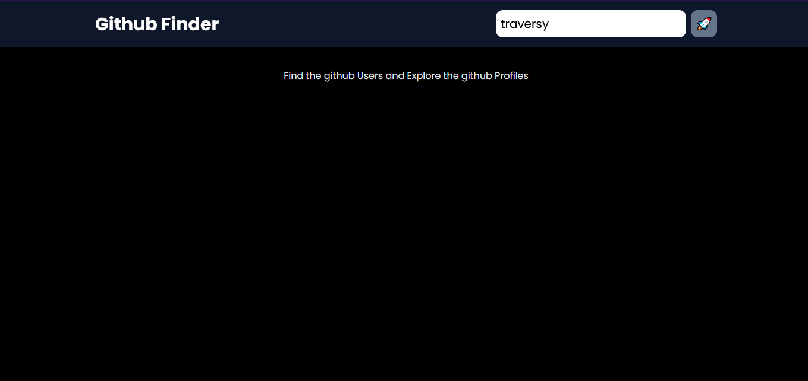

## Getting Started

Github finder is a Next js based App where anyone can easily find and explores the github user profiles

#### Download or clone

Download the code and unzip the downloaded file or git clone the project in the local environment

#### Intall the packages

To install the required packages run the following command in the command line

```bash
npm install
```

#### Run the development server:

Run the project in development mode and see the results

```bash
npm run dev
# or
yarn dev
# or
pnpm dev
```

Open [http://localhost:3000](http://localhost:3000) with your browser to see the result.

## Screenshots




